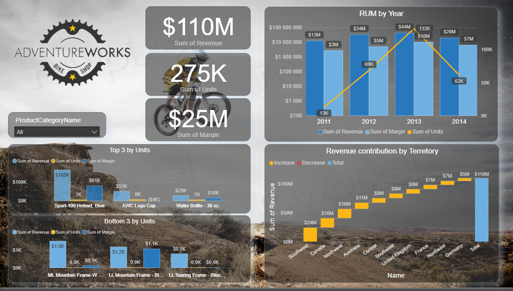
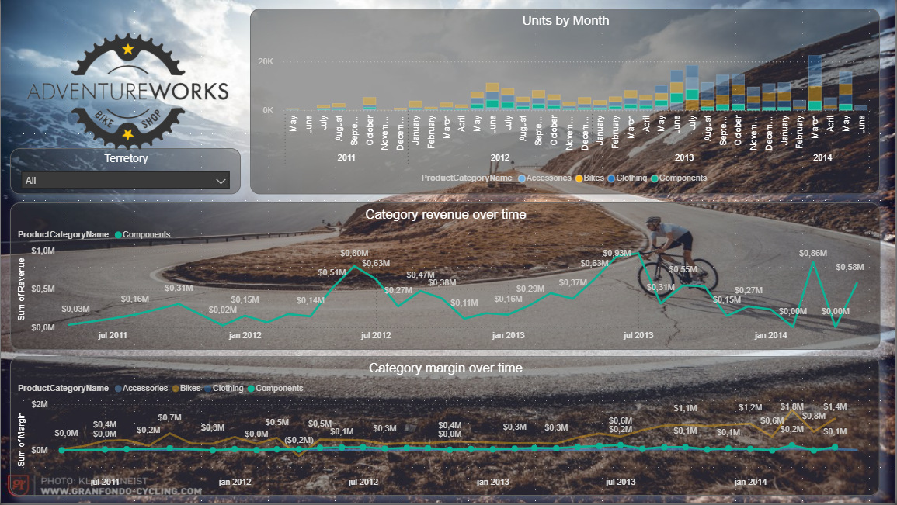

# Adventure Works BI Dashboard

  

🚀 **Interactive Power BI Dashboard: Pedal into Sales Insights with Adventure Works!**

This project transforms the classic Adventure Works bike shop dataset into a sleek, interactive dashboard. Whether you're tracking revenue spikes from mountain bike sales or spotting underperforming territories, it's all about turning data into decisions—without breaking a sweat. Built as part of my BI portfolio (Phase 2: Visualization & Interactivity), it's a quick demo of how modern tools make business intel fun and actionable.

*Sample view: Category revenue trends and territory breakdowns. 

## 📊 Key Insights at a Glance
- **Revenue Rocket:** Total sales hit $110M across 2011-2014, with a 15% YoY growth fueled by Components and Accessories.
- **Top Performers:** Northeast US leads territories at $11M—time to expand that trail network! Bikes dominate units sold (275K total).
- **Watch Out For:** Frames lag in the bottom 3 by units; margins hover around $0.5M—maybe a redesign?
- **Seasonal Spin:** Units peak in summer months, perfect for targeted promos.

These nuggets come straight from DAX-powered measures and slicer-friendly visuals. No deep dives needed—Adventure Works is sample data gold for showcasing skills, not solving world hunger. 😎

## 🎮 How to Interact
1. **Slicers for the Win:** Drop down Territory (e.g., "France") or Product Category (e.g., "Clothing") to refilter everything on the fly.
2. **Trend Surfing:** Hover over line charts for monthly breakdowns—spot that Q4 holiday bump!
3. **Drill-Down Fun:** Bar charts reveal top/bottom products; maps (implied via territories) highlight geo hotspots.
4. **Live Demo:** [Try the Published Dashboard](https://app.powerbi.com/view?r=eyJrIjoi...") – Filter 2013 Bikes and see revenue climb to $30M+.

*GIF of interactivity coming soon—stay tuned!*

## 🛠️ Tech Stack
| Tool | Role | Why? |
|------|------|------|
| **Power BI** | Dashboard & Visuals | Drag-and-drop magic for lines, bars, and KPIs. |
| **SQL Server** | Data Source | Clean ETL from Adventure Works DW tables. |
| **DAX** | Measures | Custom calcs like `Sum of Revenue` and `Sum of Margin`. |
| **TMDL** | Semantic Model | Structured relationships for scalable queries. |

## 🚀 Quick Setup (For the Curious)
If you want to tinker:
1. Download the [Adventure Works sample database](https://github.com/Microsoft/sql-server-samples/tree/master/samples/databases/adventure-works-data-warehouse).
2. Restore in SQL Server (or use the provided .bak file).
3. Open `dashboard.pbix` in Power BI Desktop → Connect to your SQL instance.
4. Import the TMDL model for replication: Load `TMDL_model_P_BI.tmdl` via Power BI's semantic model tools.
5. Publish to Power BI Service and share away!

*Note: Data is anonymized sample—zero real bikes were harmed.*

## 📁 Project Files
- `dashboard.pbix`: The full interactive report (open in Power BI Desktop).
- `TMDL_model_P_BI.tmdl`: Semantic model file for data relationships and DAX.
- `/screenshots/`: High-res shots and GIFs of the dashboard in action.

## 🔗 Connect & Contribute
This is [Phase 2 of my BI Portfolio](https://your-portfolio-link.com/projects#bi-dashboard)—check out the full series for more data adventures! Fork, star, or PR ideas welcome. Questions? Hit me up on [LinkedIn](https://linkedin.com/in/yourprofile).

**Built with ❤️ for turning spreadsheets into stories. Let's ride!** 🏔️🚴‍♂️

---
